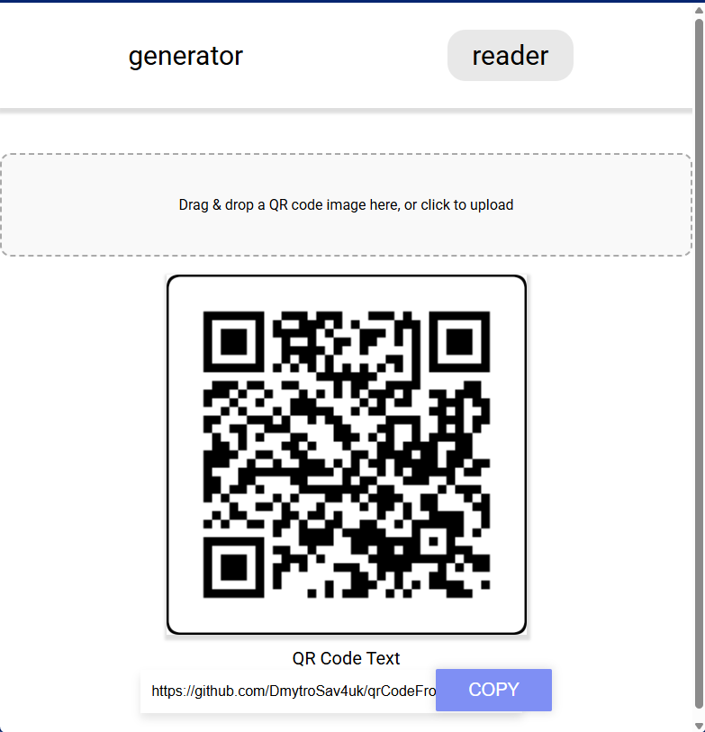

# Savchuk Dmytro IPZk-24-1
# Front-end Part

# QR Code Generator & Reader

This is the front-end part of the application for generating and reading QR codes, with additional features such as customizing appearance and uploading a logo.


### Screenshots





## 📦 Download Build

The desktop version of the built application can be downloaded at:

🔗 **[Download Ready-to-Use App](https://drive.google.com/file/d/1IqJQCkU2xuzFCtgYhpZUQDD9ArS5xWHz/view)**

*Requirements: .NET 9*

---

## ⚙️ Features

- Generate QR codes based on entered URLs
- Customize QR code appearance (colors, borders, rounding)
- Upload logo into QR code
- Download generated image
- Read QR codes from images (drag & drop / paste / upload)
- QR code generation statistics (sent to backend)
- Cross-platform (browser, desktop, mobile)

---

## 🧭 Programming Principles

The following programming principles were applied during development:

1. **Single Responsibility Principle (SRP)**  
   Each class and service handles one specific task. For example, `QrcodeService` is responsible solely for QR API communication, while `StatisticsService` handles sending analytics.

2. **Don't Repeat Yourself (DRY)**  
   Repetitive code is abstracted into services (`CrudService`, `QrcodeService`). Basic CRUD operations are centralized in `CrudService`.

3. **Separation of Concerns (SoC)**  
   UI logic is separated from business/data logic. Components like `QrGeneratorComponent` and `QrReaderComponent` delegate tasks to services and avoid HTTP logic.

4. **Open/Closed Principle (OCP)**  
   The system is open to extension but closed to modification. New QR generation parameters can be added without altering existing logic in `QrcodeService`.

5. **KISS (Keep It Simple, Stupid)**  
   Solutions are implemented as simply as possible using standard Angular mechanisms (forms, services, events) without overcomplicating the architecture.

---

## 🛠 Refactoring Techniques

Several refactoring techniques were used to improve maintainability and structure:

- **Extract Method**  
  The method `renderFinalCanvas()` was extracted to reduce the complexity of `downloadImage()`.

- **Rename Variable for Clarity**  
  Variables like `urlValue` clearly describe their purpose — the user-entered URL.

- **Encapsulate Conditionals**  
  Conditional logic was moved into dedicated methods like `clearMessages()` and `showToast()` to simplify `onSubmit()` and `onRegenerate()`.

- **Use Observable Composition**  
  RxJS operators such as `catchError` and `pipe` were used to manage async events and error handling in `QrReaderComponent`.

- **Move Logic to Service**  
  All API-related logic is handled within services (`QrcodeService`, `StatisticsService`) to keep components clean and focused.

---

## 🎯 Design Patterns

Several key design patterns were implemented:

- **Service Pattern**  
  Angular services (`QrcodeService`, `CrudService`, `StatisticsService`) encapsulate API logic.

- **Facade Pattern**  
  `CrudService` acts as a facade to simplify access to HTTP operations — centralizing all CRUD functionality.

- **Observer Pattern**  
  RxJS Observables allow the app to react to events and state changes (e.g., receiving API results).

- **Dependency Injection**  
  Angular’s DI system is used to inject services into components, enabling easy testing and replacement.

- **Module Pattern**  
  Components such as `QrGeneratorComponent` and `QrReaderComponent` are implemented as standalone modules to enhance modularity.

---

## 🚀 Run Locally

### Requirements:
- Node.js ≥ 20
- Angular CLI

### Steps:

```bash
git clone 
npm install
ng serve

```

# code amount


